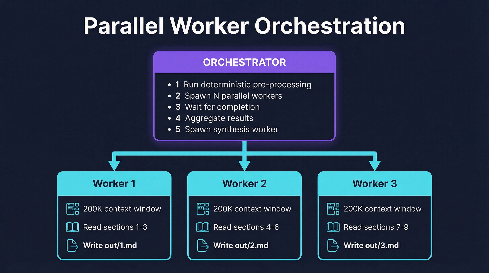
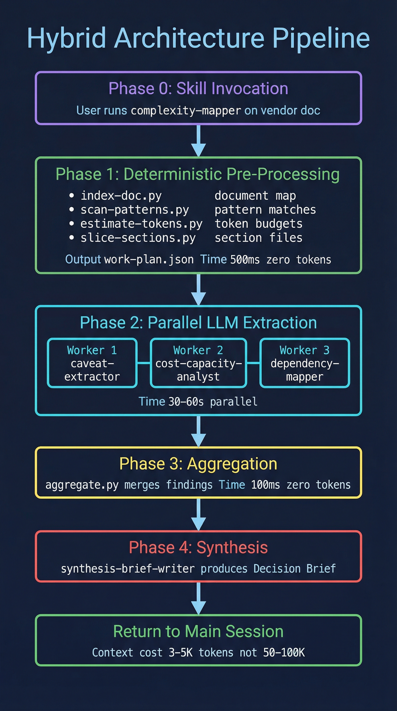
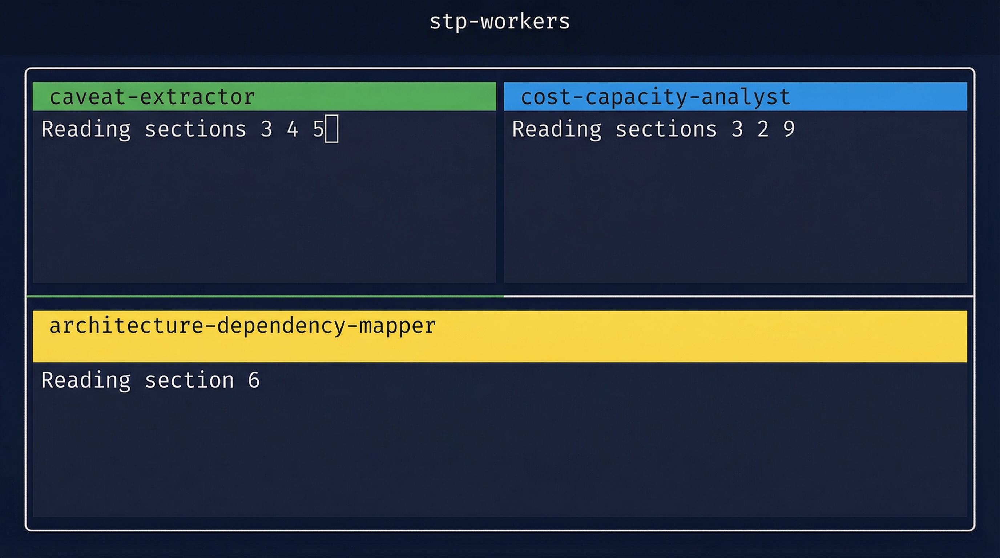

# Context Orchestration Design

## The Problem

Claude Code subagents can't spawn subagents. The current flow is:

```
Parent spawns Agent A → waits → reads result → spawns Agent B → waits → reads result → ...
```

This is sequential and slow. For a complexity-mapper workflow that needs 4-5 extraction agents, you're looking at serial round-trips where the parent is the bottleneck.

## Three Acceleration Paths

### Path 1: Deterministic Scripts (No LLM Required)

Many things our agents do don't actually need an LLM:

| Task                            | Current approach             | Script alternative                            |
| ------------------------------- | ---------------------------- | --------------------------------------------- |
| Map document structure/headings | doc-indexer agent (LLM)      | Python parser — regex/markdown-it (~100ms)    |
| Extract sections by heading     | doc-reader agent (LLM)       | Python slicer — split on headings (~50ms)     |
| Find quota/limit patterns       | caveat-extractor agent (LLM) | Regex scanner for known patterns (~100ms)     |
| Parse pricing tables            | cost-capacity-analyst (LLM)  | Table parser — structured extraction (~200ms) |
| Count tokens in a document      | Manual estimation            | tiktoken or similar (~50ms)                   |
| Compute file diffs              | LLM comparison               | diff/difflib (~10ms)                          |
| Validate output contracts       | LLM judgment                 | JSON schema validation (~10ms)                |

**The principle**: if it can be done deterministically, don't burn tokens on it. Use scripts for structure, reserve LLM agents for judgment.

**Implementation**: a `utils/` directory with Python scripts that agents and skills can call via Bash tool, or that an orchestrator invokes before spawning agents.

Example pipeline:

```
1. scripts/index-doc.py vendor-doc.md          → index.json (headings, sections, token counts)
2. scripts/slice-sections.py index.json         → sections/001.md, sections/002.md, ...
3. scripts/scan-patterns.py sections/*.md       → patterns.json (quotas, limits, prices found)
4. THEN spawn LLM agent with: sections + patterns as context
```

The agent arrives pre-armed. It knows the structure, knows where the patterns are, and focuses its 200K window on judgment — not parsing.

---

### Path 2: Background Claude CLI Instances (Parallel LLM Workers)

Claude Code's `claude` CLI can be invoked via Bash as a background process:

```bash
claude --print --dangerously-skip-permissions -p "prompt" > output.md
```

Multiple instances run in parallel, each with its own full context window. They write results to files. No subagent limitations apply — these are independent sessions.

**Architecture:**



**Key advantage**: true parallelism. Three extraction workers finish in the time of one.

**Key constraint**: each CLI invocation is a fresh session — no shared state except the filesystem. Workers communicate through files.

**Example orchestrator call from main Claude session:**

```bash
# The main Claude session (or a skill) can kick this off via Bash:
python3 utils/orchestrate.py \
  --workflow complexity-mapper \
  --input reference/vendor_docs/aws-transit-gateway.md \
  --output output/findings/ \
  --parallel 3
```

The orchestrator script:

1. Runs `index-doc.py` to map the document
2. Splits into N shards
3. Launches N `claude` CLI processes in parallel (each with a focused prompt + its shard)
4. Waits for completion (polling output files)
5. Aggregates results into `output/findings/aggregated.md`
6. Returns control to the caller

**The main Claude session resumes** by reading `output/findings/aggregated.md` — a compact, pre-synthesized artifact.

---

### Path 3: Agent Return Signals (Structured Handoff Protocol)

When a subagent finishes, it returns a structured handoff that tells the parent exactly what to do next. Instead of the parent having to figure out the next step, the agent says:

```json
{
  "status": "complete",
  "summary": "Indexed 47 sections. 12 flagged as high-value for caveat extraction.",
  "artifacts": ["output/index.json", "output/high-value-sections.md"],
  "next_actions": [
    {
      "agent": "caveat-extractor",
      "input": "output/high-value-sections.md",
      "priority": "high",
      "reason": "12 sections contain quota/limit language"
    },
    {
      "agent": "cost-capacity-analyst",
      "input": "output/sections/pricing.md",
      "priority": "medium",
      "reason": "Pricing section found with tiered model"
    }
  ],
  "token_budget_used": 1200,
  "token_budget_remaining": 30800
}
```

**This is still sequential** — the parent processes one handoff at a time. But it's fast because:

- The parent doesn't need to re-analyze what was found
- Next steps are pre-decided by the agent that had the most context
- The parent becomes a dispatcher, not a thinker

**To make it parallel**, combine with Path 2: the parent reads the handoff, then spawns multiple CLI workers for the `next_actions` simultaneously.

---

## Recommended Hybrid Architecture

Combine all three paths:



### Why This Works

| Concern                         | How it's addressed                                                  |
| ------------------------------- | ------------------------------------------------------------------- |
| Subagents can't spawn subagents | Orchestrator script bypasses this entirely — uses CLI workers       |
| Sequential round-trips are slow | Phase 2 runs workers in parallel                                    |
| Agents return too much context  | Workers write to files, parent reads compact aggregation            |
| Parsing doesn't need an LLM     | Phase 1 handles structure deterministically                         |
| 32K return cap per subagent     | Workers write unlimited output to files, not through return channel |
| Token waste on re-reading       | Pre-processing means agents arrive pre-armed with structure         |

### What Was Built

**Utility scripts (`utils/`):**

```
utils/
├── index_doc.py        # Parse document structure, map headings/sections (0 tokens)
├── slice_sections.py   # Split document into section files by heading (0 tokens)
├── scan_patterns.py    # Regex scanner for quotas, limits, prices, warnings (0 tokens)
├── estimate_tokens.py  # Token counting and sharding strategy (0 tokens)
├── aggregate.py        # Merge structured findings from multiple workers (0 tokens)
├── validate_output.py  # Check output against output contracts (0 tokens)
├── build_prompt.py     # Assemble complete prompts from agent defs + input (0 tokens)
├── orchestrate.py      # Spawn and manage parallel Claude CLI workers
└── tmux_runner.py      # Manage workers inside tmux panes
```

**Orchestrator (`utils/orchestrate.py`):**

- Two modes: `--workflow` (auto pre-process + dispatch) or `--work-plan` (skip to dispatch)
- Reads agent .md files and injects them into CLI worker prompts via build_prompt.py
- Spawns N `claude --print` processes in parallel (subprocess mode) or in tmux panes (`--tmux` flag)
- Monitors completion, handles timeouts, collects results
- Runs aggregate.py on findings, then optionally runs a synthesis worker
- Writes run-summary.json with timing and worker statuses
- `--dry-run` mode for inspecting the work plan without executing

**tmux runner (`utils/tmux_runner.py`):**

- Creates a tmux session with one pane per worker
- Writes prompts to temp files (avoids shell escaping problems)
- Monitors output files for completion sentinel
- Supports tiled, vertical, and horizontal layouts
- `--cleanup` flag tears down session when done; otherwise leaves panes for inspection
- Workers are visible in real-time — you can watch extraction happening

---

### Execution Modes

The orchestrator supports two dispatch backends, selectable via flag:

**Default mode (subprocess):**

```bash
python3 utils/orchestrate.py \
  --workflow complexity-mapper \
  --input vendor-doc.md \
  --output output/ \
  --parallel 3
```

Workers run as background processes. Fast, invisible, CI-friendly.

**tmux mode (`--tmux`):**

```bash
python3 utils/orchestrate.py \
  --workflow complexity-mapper \
  --input vendor-doc.md \
  --output output/ \
  --parallel 3 \
  --tmux \
  --tmux-session stp-workers
```

Workers run in visible tmux panes. You can:

- Watch agents working in real-time (`tmux attach -t stp-workers`)
- Jump into a pane if something stalls
- Inspect intermediate output before synthesis
- Leave panes open after completion for review

**tmux pane layout for 3 workers:**



**When to use which:**

| Scenario                   | Mode                 | Why                                 |
| -------------------------- | -------------------- | ----------------------------------- |
| Quick analysis, small doc  | Default (subprocess) | Fast, no setup                      |
| Complex multi-doc analysis | `--tmux`             | Visibility, intervention            |
| CI/automated pipeline      | Default (subprocess) | No terminal needed                  |
| Debugging agent behavior   | `--tmux`             | Watch agents in real-time           |
| Large vendor doc review    | `--tmux`             | Monitor progress, kill slow workers |

---

### How Skills Invoke the Orchestrator

Skills trigger the orchestrator via Bash tool from the main Claude session:

```bash
# From a skill like complexity-mapper:
python3 utils/orchestrate.py \
  --workflow complexity-mapper \
  --input reference/vendor_docs/aws-transit-gateway.md \
  --output output/analysis-$(date +%Y%m%d)/ \
  --parallel 3 \
  --tmux
```

The skill then reads the aggregated output:

```bash
cat output/analysis-20260311/complexity-report.md
```

This keeps the main Claude session's context clean — it only sees the final compact artifact, not the 50K+ tokens of intermediate extraction work.

---

### Open Questions

1. **Token cost**: Parallel CLI workers each consume their own API tokens. Is the speed-vs-cost tradeoff acceptable? (Likely yes for complex analyses, no for simple queries.)
2. **Model selection**: Should extraction workers use Haiku/Sonnet for cost efficiency, reserving Opus for synthesis? The `--model` flag supports this.
3. **Error handling**: If one worker fails or times out, do we retry, skip, or abort the pipeline? Currently: skip and report.
4. **Caching**: Should we cache extraction results so re-running against the same document doesn't re-invoke workers?
5. **Main session integration**: Should the orchestrator be invoked via Bash from a skill, or should skills be rewritten to call the orchestrator directly? Current recommendation: Bash from skills.
6. **CLI availability**: `claude --print --dangerously-skip-permissions` requires the CLI to be installed and authenticated. This is safe for local use but needs consideration for CI.

### Relation to Existing Plugin Structure

The current agents and skills don't need to be replaced — they evolve:

| Current                      | Evolution                                                  |
| ---------------------------- | ---------------------------------------------------------- |
| Agents as subagent .md files | Also serve as prompt templates for CLI workers             |
| Skills as playbooks          | Skills invoke orchestrate.py instead of chaining subagents |
| Hooks in settings.json       | Hooks can trigger pre-processing scripts                   |
| Output contracts in docs/    | Validation scripts enforce contracts programmatically      |
| reference/ directory         | Pre-processing scripts index it automatically              |

The subagent .md files remain the source of truth for agent behavior. The orchestrator reads them and injects them into CLI worker prompts. This means we maintain one definition per agent, used two ways:

1. As a native Claude Code subagent (for simple, single-agent tasks)
2. As a prompt template for CLI workers (for orchestrated, parallel workflows)
